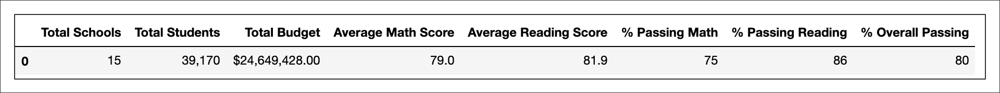
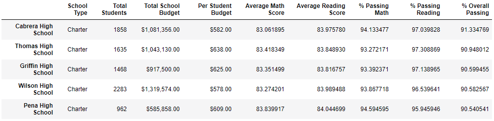
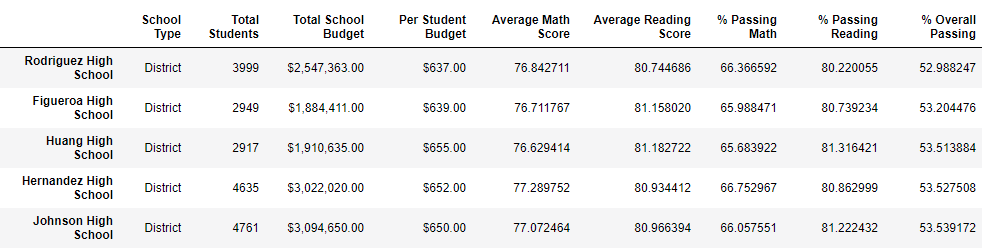
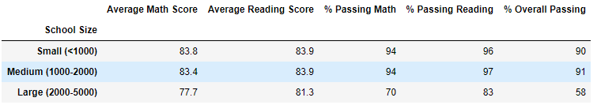
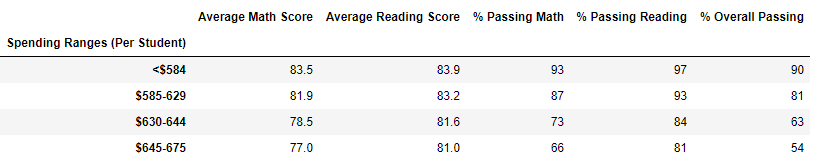
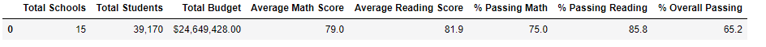
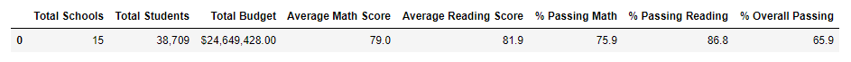
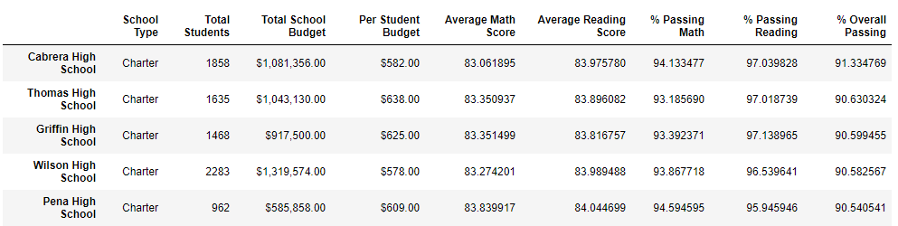

# School District Analysis

## Overview of the School District Analysis

The objective of this project was to clean the dataset and analize the school & student performace information from a specific district. the district has information from 15 schools that will be classified according to type and size as well to provide the insights requiered for a proper assesment of studen/school performace overall.

Basic metrics:
> -Math and reading scores by grade

> -Scores by school spending

> -Scores by school size

> -Scores by school type

The outcomes of the study will also help the district to properlly allocate the budget for the upcoming cicle to improve results were most are needed.

Unfortunately, during the study it was discovered that ninth graders’ math and reading scores from Thomas High School might have been corrupted, therefore the need to redo the study taking into considerarion that those were no longer valid.

Note: Changes in the updated school district analysis after reading and math scores for the ninth grade at Thomas High School have been replaced with NaNs.

## School District Summary
### Find the Highest Performing Schools
At a simple glance Cabrera High School has the highest Overall (Math and Reading) Passing Percentage.
The Summary below depicts the 5 top school performers.

### Find the Poorest Performing Schools

Rodriguez High School has the lowest performance overall (Math and Reading Passing Percentage)
The Summary below depicts the 5 low performing school.

### School performance according to size.

From this table we can observe that large schools are struggling to get a good performance, while small and medium schools are having an acceptable overall performance.

### School performance according to budget per capita.

This is quite an interesting table. It actually shows that the allocated budget per student is not directly related to school performance rather that the size of the school. Small schools, even with the lowest budget per student actually achieved the best scores and overall passing rates.

### The Thomas High School Case.

Unfortunately, the district alerted that Thomas High School 9 graders might have counterfeited their scores, hence the need to revaluate if removing those scores changed the overall assumptions made for the entire district analysis.

Calculations are now based on a new number of total students:

- Initial Total Students = 39,170
- Thomas High School Students in 9th = 461
- New Total Students = 38,709

Passing Math 75%, Passing Reading 85.8%,  65.2 % Overll Passing.

Passing Math 74.8 %, Passing Reading 85.7 %,  64.9 % Overall Passing.

Thomas High School still ranks on the top 5 performing schools

